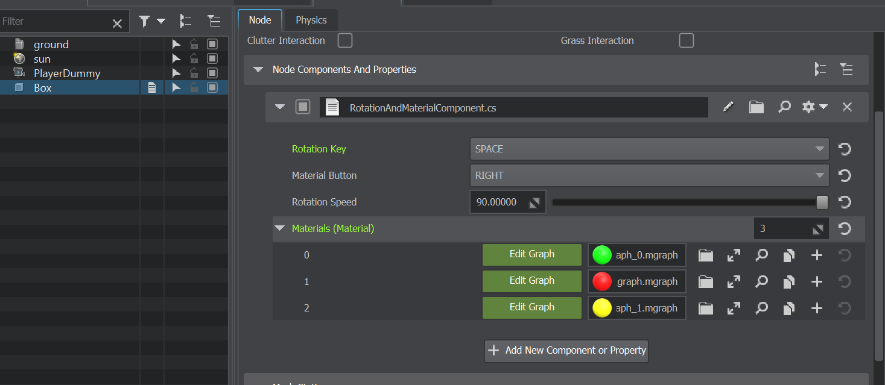

# UnigineRotation

На движке Unigine используя C# реализован компонент, который:  

1. Управляет вращением ноды вокруг оси X при нажатии клавиши Space:  
   - Первое нажатие запускает вращение.  
   - Второе нажатие меняет направление вращения на противоположное.  
   - Третье нажатие останавливает вращение.  
   - Последующие нажатия продолжают цикл (запуск → смена направления → остановка).  

2. Изменяет материал ноды при нажатии правой кнопки мыши.  

3. Позволяет настраивать управление через инспектор:
  
   - Клавиша для управления вращением (по умолчанию — Space).  
   - Кнопка мыши для смены материала (по умолчанию — Правая кнопка

